**1.Gate_AND**
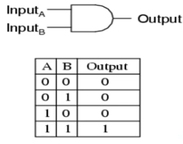

**2.Gate_OR**

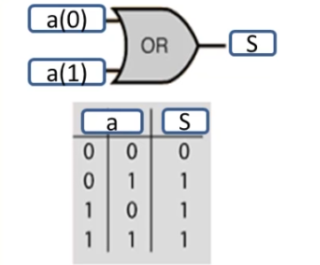

**3.Gate_NOR**

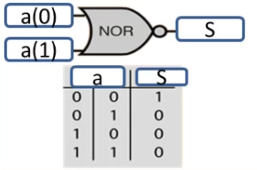

**4.Multiplex_2a1**

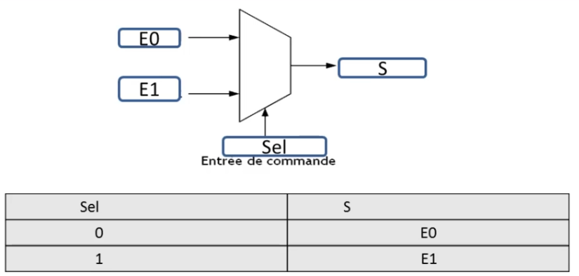

**5.Multiplex_4a1**

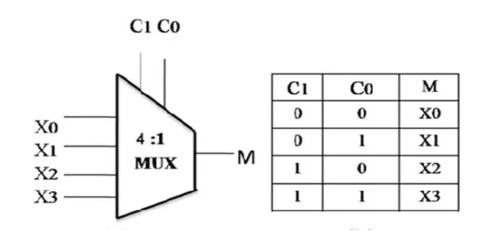

**6.Circuit1**

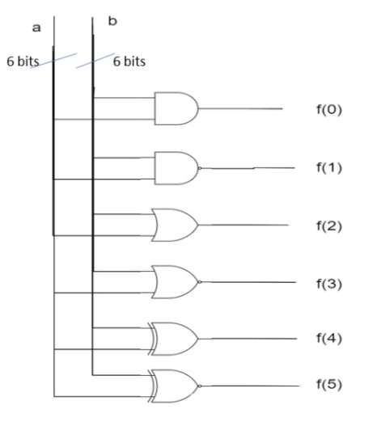

**7.Circuit2**

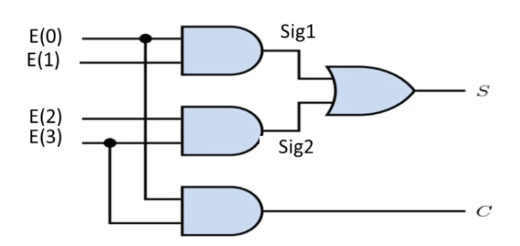

**8.Circuit3**

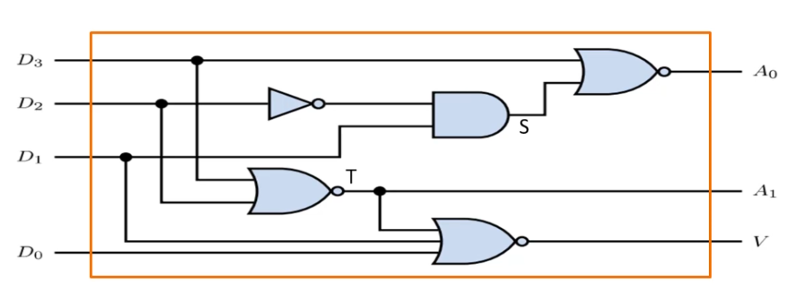

**9.Circuit4**

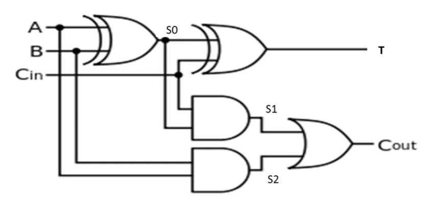

**10.Demi_Additionneur_1bit**

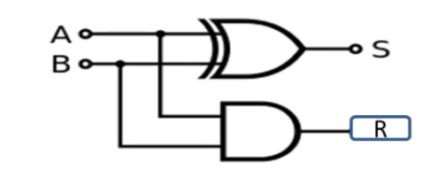

**11.Decodeur_2a4**

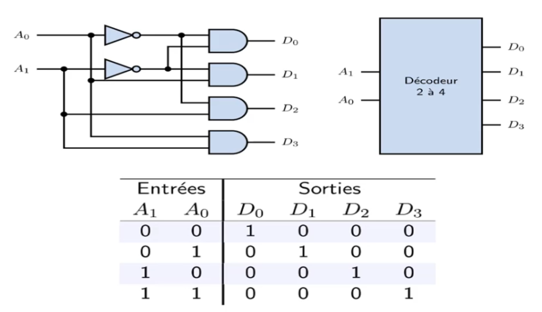

**12.decoder_7Seg**

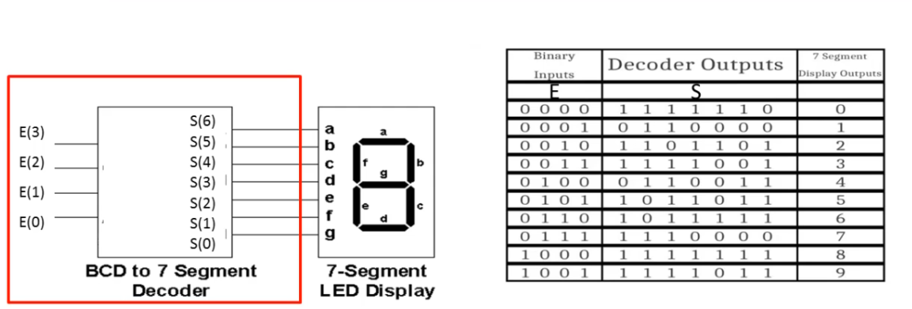

